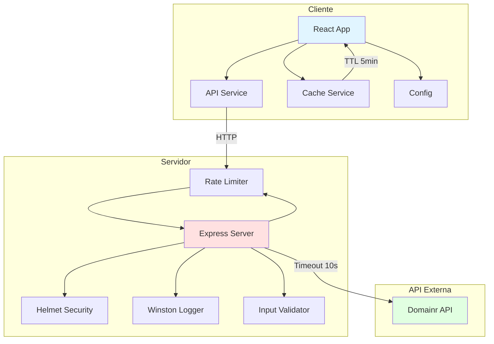
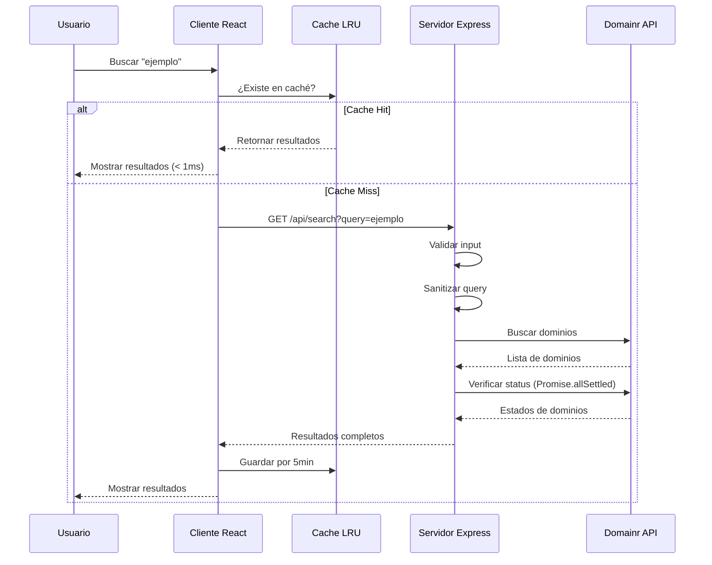
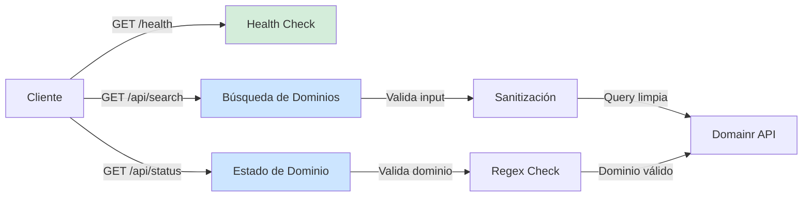
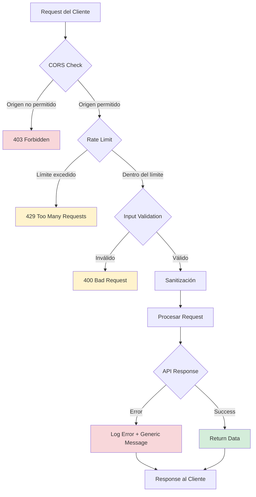
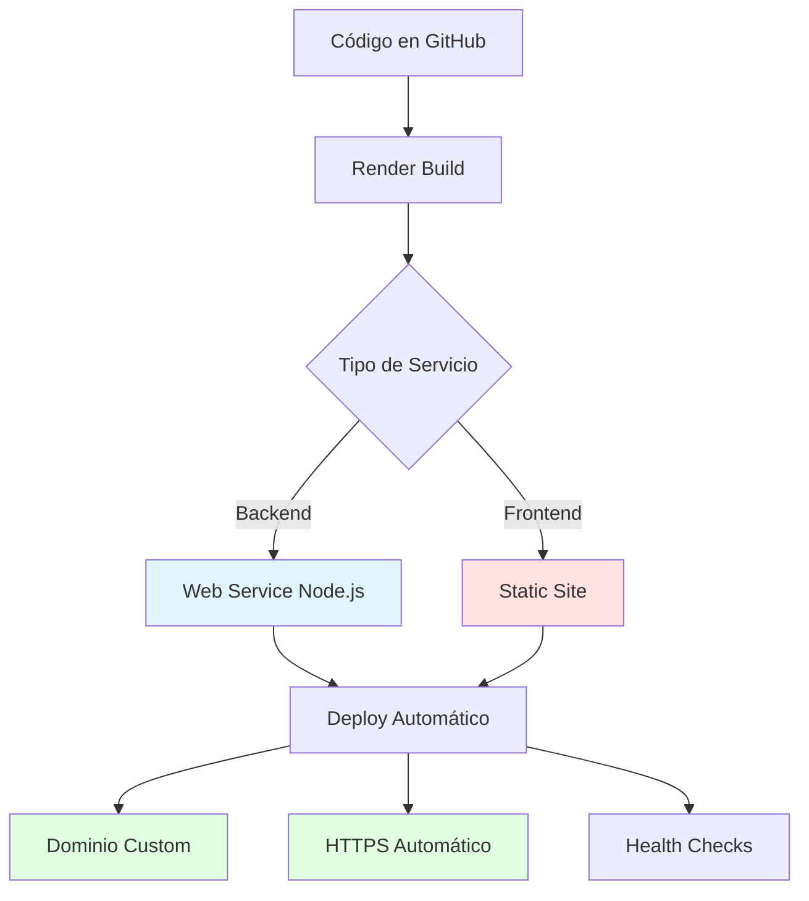

# DOMAIN CHECKER V2.0.0


Una aplicación full-stack hardened y lista para producción para verificar la disponibilidad de dominios en tiempo real. Incluye seguridad reforzada, caché inteligente, rate limiting y una extensión para Chrome.

## TABLA DE CONTENIDOS

- [Características](#características)
- [Arquitectura](#arquitectura)
- [Inicio Rápido](#inicio-rápido)
- [Instalación](#instalación)
- [Configuración](#configuración)
- [Uso](#uso)
- [API Endpoints](#api-endpoints)
- [Seguridad](#seguridad)
- [Despliegue en Producción](#despliegue-en-producción)
- [Estructura del Proyecto](#estructura-del-proyecto)
- [Tecnologías](#tecnologías)
- [Troubleshooting](#troubleshooting)
- [Contribución](#contribución)
- [Licencia](#licencia)

## CARACTERÍSTICAS

- Búsqueda inteligente de dominios sugeridos basados en palabras clave
- Verificación instantánea de disponibilidad en tiempo real
- Búsqueda ampliada con variaciones automáticas usando 11 TLDs comunes
- Exportación de resultados en formatos TXT y CSV
- Enlaces directos a Google, Bing, DuckDuckGo y Brave Search
- Diseño minimalista y responsivo en blanco y negro
- Extensión para Chrome que permite verificar dominios sin abrir la aplicación web
- Rate Limiting: 100 requests cada 15 minutos por IP (configurable)
- CORS Seguro con whitelist de dominios permitidos
- Helmet.js para headers de seguridad HTTP
- Validación robusta y sanitización de todos los inputs
- Timeouts de 10 segundos en requests externos
- Caché LRU con resultados cacheados durante 5 minutos
- Logging estructurado con Winston
- Health check endpoint para monitoreo
- Graceful shutdown con cierre limpio de conexiones

## ARQUITECTURA



### FLUJO DE BÚSQUEDA



## INICIO RÁPIDO

### PREREQUISITOS

- Node.js >= 14.0.0
- npm >= 6.0.0
- Clave API de RapidAPI (Domainr)

### PASO 1: SUSCRIPCIÓN A LA API

1. Ir a https://rapidapi.com/layered-layered-default/api/domains-api
2. Iniciar sesión o crear cuenta
3. Hacer clic en "Subscribe to Test"
4. Elegir plan "Basic" (GRATIS - 50 requests/mes)
5. Confirmar suscripción

### PASO 2: INSTALACIÓN

```bash
# Clonar repositorio
git clone https://github.com/686f6c61/Domain-Checker.git
cd Domain-Checker

# Instalar dependencias del servidor
cd server
npm install

# Instalar dependencias del cliente
cd ../client
npm install
```

### PASO 3: CONFIGURACIÓN

```bash
# Servidor
cd server
cp .env.example .env
# Editar .env y agregar tu RAPIDAPI_KEY

# Cliente
cd ../client
cp .env.example .env
```

### PASO 4: EJECUCIÓN

#### OPCIÓN A: SCRIPT AUTOMÁTICO (RECOMENDADO)

```bash
# Desde la raíz del proyecto
./start.sh
```

El script `start.sh` automáticamente:
- Verifica y crea los archivos .env si no existen
- Instala dependencias si es necesario
- Verifica que los puertos 3000 y 5000 estén disponibles
- Inicia el servidor backend (puerto 5000)
- Inicia el cliente frontend (puerto 3000)
- Muestra logs en tiempo real
- Permite detener ambos servicios con Ctrl+C

#### OPCIÓN B: MANUAL

```bash
# Terminal 1 - Servidor
cd server
npm run dev

# Terminal 2 - Cliente
cd client
npm start

# Abrir http://localhost:3000
```

### VERIFICACIÓN

```bash
# Health check
curl http://localhost:5000/health

# Respuesta esperada:
# {
#   "status": "ok",
#   "timestamp": "...",
#   "uptime": 123.45,
#   "environment": "development"
# }
```

## INSTALACIÓN

### REQUISITOS DEL SISTEMA

- Sistema Operativo: Linux, macOS, Windows
- Node.js: versión 14.x o superior
- npm: versión 6.x o superior
- RAM: mínimo 512MB
- Espacio en disco: 200MB

### INSTALACIÓN DETALLADA

#### SERVIDOR

```bash
cd server
npm install
```

Dependencias instaladas:
- express@5.1.0 - Framework web
- axios@1.9.0 - Cliente HTTP
- cors@2.8.5 - Middleware CORS
- dotenv@16.5.0 - Variables de entorno
- express-rate-limit@8.2.1 - Rate limiting
- helmet@8.1.0 - Headers de seguridad
- winston@3.18.3 - Logging estructurado

#### CLIENTE

```bash
cd client
npm install
```

Dependencias instaladas:
- react@19.1.0 - Librería UI
- react-dom@19.1.0 - React DOM
- axios@1.9.0 - Cliente HTTP
- react-icons@5.5.0 - Iconos SVG
- react-scripts@5.0.1 - Scripts de desarrollo

## CONFIGURACIÓN

### VARIABLES DE ENTORNO DEL SERVIDOR

Archivo: `server/.env`

```bash
# OBLIGATORIAS
RAPIDAPI_KEY=tu_clave_api_aqui
CLIENT_URL=http://localhost:3000

# OPCIONALES (valores por defecto mostrados)
PORT=5000
NODE_ENV=development
RATE_LIMIT_WINDOW_MS=900000      # 15 minutos
RATE_LIMIT_MAX_REQUESTS=100      # Requests por ventana
API_TIMEOUT=10000                # Timeout en milisegundos
```

### VARIABLES DE ENTORNO DEL CLIENTE

Archivo: `client/.env`

```bash
REACT_APP_API_URL=http://localhost:5000
REACT_APP_ENV=development
```

### CONFIGURACIÓN DE CACHÉ

Archivo: `client/src/config.js`

```javascript
export const CACHE_CONFIG = {
  ENABLED: true,
  TTL: 5 * 60 * 1000,  // 5 minutos
  MAX_SIZE: 100         // Máximo de entradas
};
```

### CONFIGURACIÓN DE RATE LIMITING

Para ajustar el rate limiting según tráfico esperado:

```bash
# En server/.env

# Más permisivo (desarrollo con mucho tráfico)
RATE_LIMIT_MAX_REQUESTS=200
RATE_LIMIT_WINDOW_MS=600000  # 10 minutos

# Más restrictivo (producción)
RATE_LIMIT_MAX_REQUESTS=50
RATE_LIMIT_WINDOW_MS=900000  # 15 minutos
```

### CONFIGURACIÓN DE TLDs

Archivo: `client/src/config.js`

```javascript
export const COMMON_TLDS = [
  'com', 'net', 'org', 'io', 'co',
  'app', 'dev', 'tech', 'ai', 'shop', 'store'
];
```

## USO

### BÚSQUEDA BÁSICA

1. Ingresar nombre o palabra clave en el campo de búsqueda
2. Hacer clic en "Buscar"
3. Los resultados mostrarán dominios disponibles (verde) y no disponibles (rojo)

### BÚSQUEDA AMPLIADA

1. Después de una búsqueda inicial
2. Hacer clic en "Listar más dominios"
3. El sistema buscará variaciones con diferentes TLDs

### EXPORTACIÓN DE RESULTADOS

**Formato TXT:**
- Hacer clic en "Exportar TXT"
- Se descarga archivo `dominios-{query}-{fecha}.txt`

**Formato CSV:**
- Hacer clic en "Exportar CSV"
- Se descarga archivo `dominios-{query}-{fecha}.csv`
- Columnas: Dominio, Estado, Tipo

### BÚSQUEDA DE OPCIONES DE COMPRA

Para dominios disponibles:
- Iconos de búsqueda disponibles
- Hacer clic para buscar en Google, Bing, DuckDuckGo o Brave Search

### EXTENSIÓN DE CHROME

#### INSTALACIÓN

1. Navegar a la carpeta `extension` del proyecto
2. Abrir Chrome y ir a `chrome://extensions/`
3. Activar "Modo desarrollador" (esquina superior derecha)
4. Hacer clic en "Cargar descomprimida"
5. Seleccionar la carpeta `extension`

#### USO DE LA EXTENSIÓN

1. Hacer clic en el ícono de la extensión en la barra de herramientas
2. Introducir la API key cuando se solicite (solo primera vez)
3. Buscar dominios directamente desde el navegador

## API ENDPOINTS

### DIAGRAMA DE ENDPOINTS



### GET /health

Health check endpoint para monitoreo.

**Request:**
```bash
curl http://localhost:5000/health
```

**Response:**
```json
{
  "status": "ok",
  "timestamp": "2024-11-24T10:00:00.000Z",
  "uptime": 123.45,
  "environment": "development"
}
```

### GET /api/search

Busca dominios relacionados con la consulta.

**Parámetros:**
- `query` (string, requerido): Término de búsqueda (2-100 caracteres)

**Request:**
```bash
curl "http://localhost:5000/api/search?query=ejemplo"
```

**Response exitosa:**
```json
{
  "results": [
    {
      "domain": "ejemplo.com",
      "status": "active",
      "summary": "active",
      "zone": "com"
    }
  ]
}
```

**Errores posibles:**
```json
// Query vacío
{"error": "Query parameter is required", "code": "MISSING_QUERY"}

// Query muy corto
{"error": "Query must be at least 2 characters", "code": "QUERY_TOO_SHORT"}

// Query muy largo
{"error": "Query must be less than 100 characters", "code": "QUERY_TOO_LONG"}

// Rate limit excedido
{"error": "Too many requests from this IP, please try again later."}

// Problema con API key
{"error": "Service temporarily unavailable", "code": "API_AUTH_ERROR"}

// Timeout
{"error": "External service timeout", "code": "API_TIMEOUT"}
```

### GET /api/status

Verifica el estado de un dominio específico.

**Parámetros:**
- `domain` (string, requerido): Nombre de dominio válido

**Request:**
```bash
curl "http://localhost:5000/api/status?domain=ejemplo.com"
```

**Response:**
```json
{
  "status": [
    {
      "domain": "ejemplo.com",
      "status": "active",
      "summary": "active"
    }
  ]
}
```

**Errores posibles:**
```json
// Domain vacío
{"error": "Domain parameter is required", "code": "MISSING_DOMAIN"}

// Formato inválido
{"error": "Invalid domain format", "code": "INVALID_DOMAIN"}
```

### CÓDIGOS DE ERROR

| Código | Significado | Acción |
|--------|-------------|--------|
| MISSING_QUERY | Query no proporcionado | Proporcionar parámetro query |
| QUERY_TOO_SHORT | Query < 2 caracteres | Usar al menos 2 caracteres |
| QUERY_TOO_LONG | Query > 100 caracteres | Reducir longitud |
| MISSING_DOMAIN | Domain no proporcionado | Proporcionar parámetro domain |
| INVALID_DOMAIN | Formato de dominio inválido | Verificar formato |
| API_AUTH_ERROR | Problema con API key | Verificar suscripción RapidAPI |
| API_RATE_LIMIT | Rate limit de API externa | Esperar antes de reintentar |
| API_TIMEOUT | Timeout en API externa | Reintentar solicitud |
| NOT_FOUND | Ruta no existe | Verificar endpoint |

## SEGURIDAD

### ANÁLISIS DE SEGURIDAD



### VULNERABILIDADES ARREGLADAS

| Vulnerabilidad | v1.0 | v2.0 | Impacto |
|----------------|------|------|---------|
| URLs Hardcodeadas | CRÍTICO | ARREGLADO | App no funcional en producción |
| CORS Abierto | CRÍTICO | ARREGLADO | CSRF, uso no autorizado |
| Sin Rate Limiting | CRÍTICO | ARREGLADO | Abuso, gastos excesivos |
| Sin Validación | ALTO | ARREGLADO | Injection attacks |
| Sin Timeouts | MEDIO | ARREGLADO | Exhaustion attacks |
| Sin Headers Seguridad | MEDIO | ARREGLADO | XSS, clickjacking |
| Memory Leaks | BAJO | ARREGLADO | Degradación performance |
| Regex Bugs | BAJO | ARREGLADO | Funcionalidad incorrecta |

### FEATURES DE SEGURIDAD IMPLEMENTADAS

**Rate Limiting**
```javascript
// server/index.js
const limiter = rateLimit({
  windowMs: 15 * 60 * 1000, // 15 minutos
  max: 100,                 // 100 requests por ventana
  standardHeaders: true,
  handler: (req, res) => {
    logger.warn(`Rate limit exceeded for IP: ${req.ip}`);
    res.status(429).json({
      error: 'Too many requests from this IP, please try again later.'
    });
  }
});
```

**CORS Restrictivo**
```javascript
const corsOptions = {
  origin: (origin, callback) => {
    const allowedOrigins = CLIENT_URL.split(',').map(url => url.trim());
    if (allowedOrigins.includes(origin) || NODE_ENV === 'development') {
      callback(null, true);
    } else {
      logger.warn(`Blocked CORS request from origin: ${origin}`);
      callback(new Error('Not allowed by CORS'));
    }
  },
  credentials: true
};
```

**Input Sanitization**
```javascript
const sanitizeInput = (input) => {
  if (typeof input !== 'string') return '';
  return input.trim().replace(/[<>]/g, '');
};
```

**Validación de Dominios**
```javascript
const domainRegex = /^[a-zA-Z0-9]([a-zA-Z0-9-]{0,61}[a-zA-Z0-9])?(\.[a-zA-Z0-9]([a-zA-Z0-9-]{0,61}[a-zA-Z0-9])?)*$/;
if (!domainRegex.test(domain)) {
  return res.status(400).json({
    error: 'Invalid domain format',
    code: 'INVALID_DOMAIN'
  });
}
```

**Headers de Seguridad (Helmet.js)**
```
Strict-Transport-Security: max-age=31536000; includeSubDomains
X-Content-Type-Options: nosniff
X-DNS-Prefetch-Control: off
X-Download-Options: noopen
X-Frame-Options: SAMEORIGIN
X-Permitted-Cross-Domain-Policies: none
```

## DESPLIEGUE EN PRODUCCIÓN

### OPCIÓN 1: RENDER (RECOMENDADO)



#### DESPLIEGUE DEL BACKEND EN RENDER

1. Crear cuenta en https://render.com
2. Conectar repositorio de GitHub
3. Crear nuevo "Web Service"
4. Configuración:
   ```
   Name: domain-checker-api
   Environment: Node
   Build Command: cd server && npm install
   Start Command: cd server && npm start
   ```

5. Variables de entorno:
   ```
   RAPIDAPI_KEY=tu_clave_api
   NODE_ENV=production
   CLIENT_URL=https://tu-frontend.onrender.com
   PORT=5000
   RATE_LIMIT_WINDOW_MS=900000
   RATE_LIMIT_MAX_REQUESTS=100
   API_TIMEOUT=10000
   ```

6. Hacer clic en "Create Web Service"

#### DESPLIEGUE DEL FRONTEND EN RENDER

1. Crear nuevo "Static Site"
2. Configuración:
   ```
   Name: domain-checker-client
   Build Command: cd client && npm install && npm run build
   Publish Directory: client/build
   ```

3. Variables de entorno:
   ```
   REACT_APP_API_URL=https://domain-checker-api.onrender.com
   REACT_APP_ENV=production
   ```

4. Hacer clic en "Create Static Site"

#### CONFIGURACIÓN POST-DESPLIEGUE

```bash
# Actualizar CLIENT_URL en el backend
# En Render Dashboard -> Web Service -> Environment
CLIENT_URL=https://domain-checker-client.onrender.com

# Verificar health check
curl https://domain-checker-api.onrender.com/health
```

## ESTRUCTURA DEL PROYECTO

```
domain-checker/
├── client/                     # Frontend React
│   ├── public/
│   │   ├── index.html
│   │   └── manifest.json
│   ├── src/
│   │   ├── services/
│   │   │   ├── api.js         # Servicio de API con interceptors
│   │   │   └── cache.js       # Sistema de caché LRU
│   │   ├── config.js          # Configuración centralizada
│   │   ├── App.js             # Componente principal
│   │   ├── App.css
│   │   └── index.js
│   ├── .env.example
│   ├── .env
│   └── package.json
├── server/                     # Backend Express
│   ├── index.js               # API con seguridad hardened
│   ├── .env.example
│   ├── .env
│   └── package.json
├── extension/                  # Extensión Chrome
│   ├── popup.html
│   ├── popup.js
│   ├── config.js
│   ├── styles.css
│   └── manifest.json
├── start.sh                    # Script de inicio automático
├── .gitignore
└── README.md
```

### ARCHIVOS PRINCIPALES

**client/src/services/api.js** - Servicio centralizado de API
```javascript
// Interceptors de Axios
// Manejo de errores HTTP
// Funciones: searchDomains, checkDomainStatus, checkMultipleDomainStatus
```

**client/src/services/cache.js** - Sistema de caché LRU
```javascript
// Clase Cache con métodos:
// get, set, delete, clear, size, setEnabled
```

**client/src/config.js** - Configuración centralizada
```javascript
// API_BASE_URL, API_ENDPOINTS, HTTP_TIMEOUT
// CACHE_CONFIG, COMMON_TLDS, DOMAIN_STATUS
```

**server/index.js** - Servidor Express con seguridad
```javascript
// Winston logging
// Helmet.js headers
// Rate limiting
// CORS restrictivo
// Input validation
// Error handling
// Graceful shutdown
```

## TECNOLOGÍAS

### FRONTEND

| Tecnología | Versión | Propósito |
|------------|---------|-----------|
| React | 19.1.0 | Librería de interfaz de usuario |
| Axios | 1.9.0 | Cliente HTTP con interceptors |
| React Icons | 5.5.0 | Librería de iconos SVG |

### BACKEND

| Tecnología | Versión | Propósito |
|------------|---------|-----------|
| Node.js | 14+ | Entorno de ejecución |
| Express | 5.1.0 | Framework web |
| Axios | 1.9.0 | Cliente HTTP para API externa |
| dotenv | 16.5.0 | Gestión de variables de entorno |
| cors | 2.8.5 | Middleware CORS con whitelist |
| helmet | 8.1.0 | Headers de seguridad HTTP |
| express-rate-limit | 8.2.1 | Rate limiting por IP |
| winston | 3.18.3 | Logging estructurado |

### API EXTERNA

- Domainr API vía RapidAPI
- Base URL: `https://domainr.p.rapidapi.com`
- Endpoints: `/v2/search`, `/v2/status`

## MIGRACIÓN DESDE V1.0

### CAMBIOS REQUERIDOS

#### 1. ACTUALIZAR DEPENDENCIAS

```bash
# Servidor
cd server
npm install express-rate-limit helmet winston

# Cliente (sin cambios en dependencias)
cd client
npm install
```

#### 2. CREAR ARCHIVOS .ENV

```bash
# Servidor
cp server/.env.example server/.env
# Editar y agregar RAPIDAPI_KEY

# Cliente
cp client/.env.example client/.env
```

#### 3. ACTUALIZAR CÓDIGO DEL CLIENTE

Si personalizaste `App.js`, necesitas:

- Importar servicios de API desde `services/api.js`
- Importar configuración desde `config.js`
- Usar `useCallback` para funciones que dependan de state
- Agregar `URL.revokeObjectURL()` en funciones de exportación

#### 4. VERIFICAR VARIABLES DE ENTORNO

Asegúrate de que:
- `RAPIDAPI_KEY` está configurada en `server/.env`
- `CLIENT_URL` apunta a tu dominio de frontend
- `REACT_APP_API_URL` apunta a tu dominio de backend

#### 5. PROBAR LOCALMENTE

```bash
# Terminal 1
cd server && npm run dev

# Terminal 2
cd client && npm start

# Verificar
curl http://localhost:5000/health
```

### LISTA DE VERIFICACIÓN DE MIGRACIÓN

- [ ] Dependencias instaladas
- [ ] Archivos .env creados y configurados
- [ ] Variables de entorno verificadas
- [ ] Health check funcionando
- [ ] Búsquedas funcionando
- [ ] Exportación funcionando
- [ ] Extensión actualizada (si se usa)
- [ ] Tests pasando
- [ ] Despliegue en producción

## TROUBLESHOOTING

### SERVIDOR NO INICIA

**Síntoma:** Error al ejecutar `npm run dev`

**Solución:**
```bash
# Verificar que existe .env
ls -la server/.env

# Verificar contenido
cat server/.env

# Si no existe
cp server/.env.example server/.env
# Editar y agregar RAPIDAPI_KEY
```

**Síntoma:** "RAPIDAPI_KEY is not defined"

**Solución:**
El servidor valida la API key al inicio. Asegúrate de que:
1. El archivo `server/.env` existe
2. Contiene la línea `RAPIDAPI_KEY=tu_clave_api`
3. No hay espacios alrededor del signo `=`

### ERRORES DE API

**Síntoma:** "You are not subscribed to this API"

**Solución:**
1. Ir a https://rapidapi.com/layered-layered-default/api/domains-api
2. Iniciar sesión
3. Suscribirse al plan Basic (gratis)

**Síntoma:** "Service temporarily unavailable"

**Solución:**
- Verificar que la API key es correcta
- Verificar suscripción a Domainr API
- Revisar logs del servidor para detalles

**Síntoma:** "Too many requests"

**Solución:**
- Esperar 15 minutos (rate limit)
- O ajustar `RATE_LIMIT_MAX_REQUESTS` en `.env`

### ERRORES DE CORS

**Síntoma:** "CORS policy: No 'Access-Control-Allow-Origin' header"

**Solución:**
```bash
# En server/.env, verificar:
CLIENT_URL=http://localhost:3000

# O para múltiples orígenes:
CLIENT_URL=http://localhost:3000,https://tu-dominio.com
```

### PUERTO EN USO

**Síntoma:** "Port 5000 is already in use"

**Solución:**
```bash
# Encontrar proceso
lsof -i :5000

# Matar proceso
kill -9 <PID>

# O cambiar puerto en .env
PORT=5001
```

### CLIENTE NO SE CONECTA AL SERVIDOR

**Síntoma:** "Network Error" en consola del navegador

**Solución:**
1. Verificar que el servidor está corriendo
2. Verificar URL en `client/.env`:
   ```
   REACT_APP_API_URL=http://localhost:5000
   ```
3. Reiniciar cliente para que cargue nuevas variables de entorno

### CACHÉ NO FUNCIONA

**Síntoma:** Búsquedas no se guardan en caché

**Solución:**
Verificar configuración en `client/src/config.js`:
```javascript
export const CACHE_CONFIG = {
  ENABLED: true,  // Debe ser true
  TTL: 5 * 60 * 1000,
  MAX_SIZE: 100
};
```

### PROBLEMAS EN PRODUCCIÓN

**Síntoma:** "Mixed Content" errors

**Solución:**
Asegúrate de que:
- Frontend usa HTTPS
- `REACT_APP_API_URL` usa HTTPS
- Backend tiene certificado SSL válido

**Síntoma:** Rate limiting muy estricto

**Solución:**
Ajustar en `server/.env`:
```bash
RATE_LIMIT_MAX_REQUESTS=200
```

### LOGS PARA DEBUGGING

```bash
# Servidor (desarrollo)
cd server && npm run dev
# Los logs aparecerán en consola con Winston

# Servidor (PM2)
pm2 logs domain-checker-api

# Nginx
tail -f /var/log/nginx/error.log

# Docker
docker-compose logs -f api
```

## CONTRIBUCIÓN

Las contribuciones son bienvenidas. Para contribuir:

1. Hacer fork del proyecto
2. Crear rama para tu funcionalidad: `git checkout -b feature/nueva-funcionalidad`
3. Realizar cambios
4. Hacer commit: `git commit -m 'Agregar nueva funcionalidad'`
5. Hacer push: `git push origin feature/nueva-funcionalidad`
6. Abrir Pull Request

### GUÍAS DE CONTRIBUCIÓN

- Seguir convenciones de código existentes
- Agregar tests para nuevas funcionalidades
- Actualizar documentación según necesidad
- Commits descriptivos en español
- Sin emojis en código o commits

## LICENCIA

Este proyecto está licenciado bajo la Licencia MIT.

```
MIT License

Copyright (c) 2025 686f6c61

Permission is hereby granted, free of charge, to any person obtaining a copy
of this software and associated documentation files (the "Software"), to deal
in the Software without restriction, including without limitation the rights
to use, copy, modify, merge, publish, distribute, sublicense, and/or sell
copies of the Software, and to permit persons to whom the Software is
furnished to do so, subject to the following conditions:

The above copyright notice and this permission notice shall be included in all
copies or substantial portions of the Software.

THE SOFTWARE IS PROVIDED "AS IS", WITHOUT WARRANTY OF ANY KIND, EXPRESS OR
IMPLIED, INCLUDING BUT NOT LIMITED TO THE WARRANTIES OF MERCHANTABILITY,
FITNESS FOR A PARTICULAR PURPOSE AND NONINFRINGEMENT. IN NO EVENT SHALL THE
AUTHORS OR COPYRIGHT HOLDERS BE LIABLE FOR ANY CLAIM, DAMAGES OR OTHER
LIABILITY, WHETHER IN AN ACTION OF CONTRACT, TORT OR OTHERWISE, ARISING FROM,
OUT OF OR IN CONNECTION WITH THE SOFTWARE OR THE USE OR OTHER DEALINGS IN THE
SOFTWARE.
```

---

**Proyecto:** Domain Checker v2.0.0
**Autor:** [686f6c61](https://github.com/686f6c61)
**v2.0 Mejoras:** Implementadas Noviembre 2025
**Estado:** Listo para Producción
